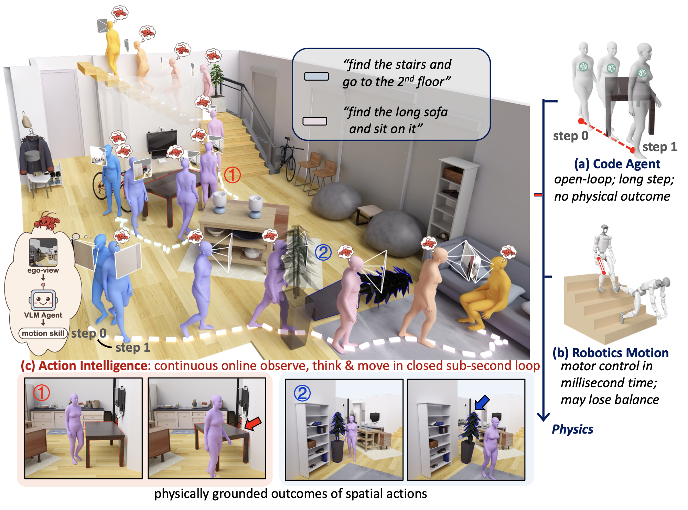

<div align="center">

# HumanCLAW: Can Vision-Language Models Act<br>Through a Body?

[**🌐 Project Page**](https://human-claw.github.io) &nbsp;|&nbsp; [**📄 Paper (arXiv:2607.27180)**](https://arxiv.org/abs/2607.27180) &nbsp;|&nbsp; [**🏆 Leaderboard**](https://human-claw.github.io/#leaderboard)

</div>

<p align="center">
  
</p>

**HumanCLAW** is an evaluation framework that decouples a VLM's action decision-making from low-level motor execution. At every sub-second step, a harnessed, off-the-shelf VLM issues an atomic whole-body skill; the skill is realized as continuous full-body motion with real physical consequences—contact, collision, and gravity—while balance and motor-tracking failures are factored out. What remains measurable is the model's **action intelligence**: its moment-to-moment choice of what the body should execute next.

On top of the framework, **HumanCLAW-Bench** provides **1,218 long-horizon, egocentric `find–navigate–interact` episodes across 41 indoor scenes**. Across nine state-of-the-art VLMs, none solves the benchmark—the best model reaches only a **16.8%** success rate. What current VLMs lack is **embodied self-awareness**: they lose track of the body they control—where it is, whether it has arrived, and when it has collided with the world.

## 🚧 Release Plan

The code and benchmark are being prepared for release. Stay tuned!

- [ ] HumanCLAW harness (VLM skill interface, verifier, motion generator, half-physics simulator)
- [ ] Motion generator weights (skill-conditioned motion prior + per-skill adapters)
- [ ] Half-physics simulation environment
- [ ] HumanCLAW-Bench episodes and evaluation metrics
- [ ] Leaderboard submission guide

In the meantime, see the [project page](https://human-claw.github.io) for demos, the failure-analysis gallery, and the leaderboard.

## 📌 Citation

If you find HumanCLAW useful, please cite:

```bibtex
@article{siyao2026humanclaw,
  title   = {HumanCLAW: Can Vision-Language Models Act Through a Body?},
  author  = {Li, Siyao and Gu, Jiawei and Liu, Shuai and Hu, Kairui and Li, Zekun and
             Li, Linjie and Tang, Chengcheng and Wu, Po-Chen and Shugurov, Ivan and
             Ma, Lingni and Zollhoefer, Michael and An, Sizhe and Mittal, Abhay and
             Zhao, Amy and Krishna, Ranjay and Li, Manling and Liu, Ziwei and Guo, Chuan},
  journal = {arXiv preprint arXiv:2607.27180},
  year    = {2026}
}
```
