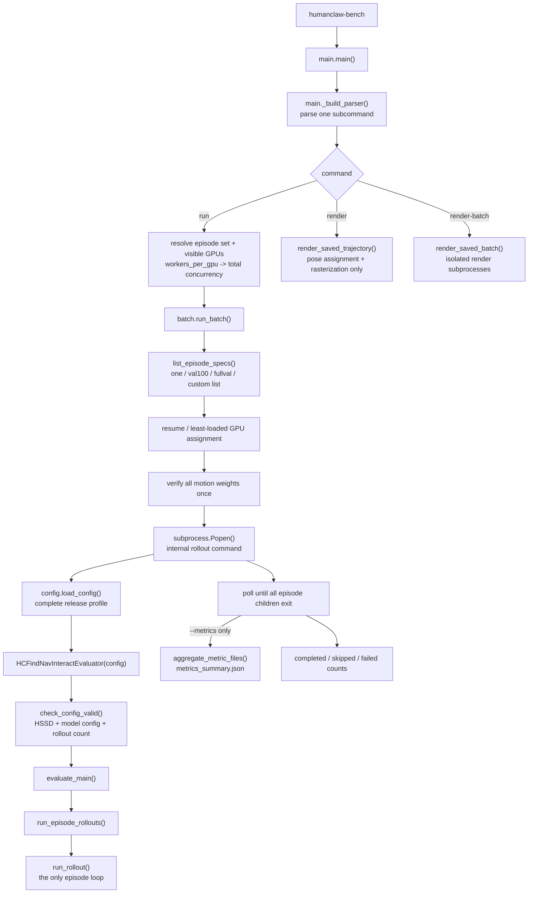
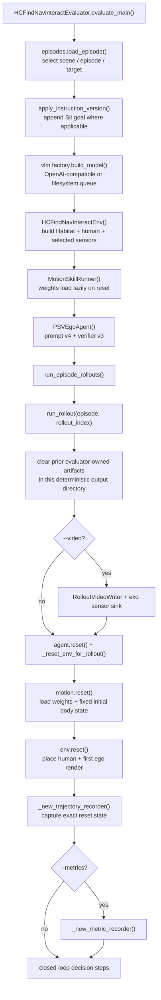
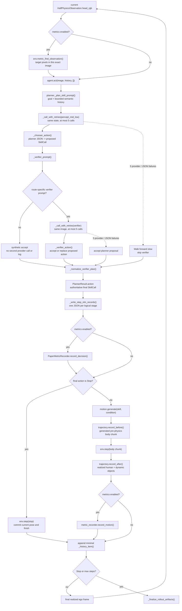
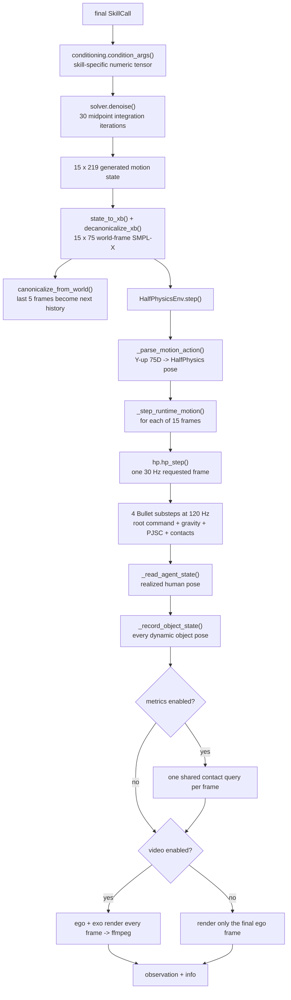
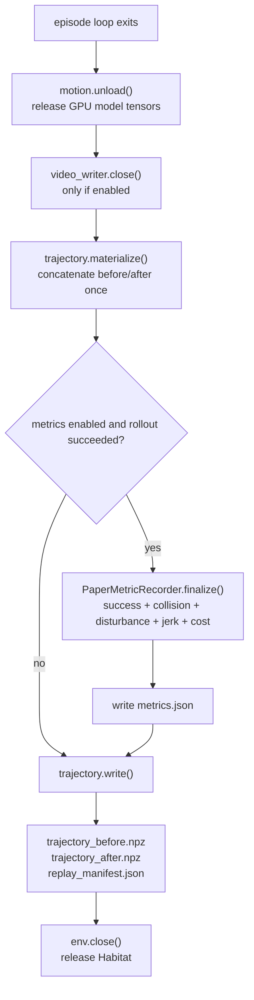

<div align="right"><a href="ARCHITECTURE_zh.md">中文</a></div>

# Evaluation architecture

HumanClawBench has one single-episode evaluation implementation. The public
`run` command selects one episode, val100, fullval, or a custom list, then the
dispatcher schedules independent internal `rollout` subprocesses. It does not
contain a second agent loop or metric implementation.

The shortest useful reading order is:

1. [`main.py`](../src/humanclaw_bench/main.py) -- command-line dispatch.
2. [`evaluation/evaluator.py`](../src/humanclaw_bench/evaluation/evaluator.py)
   -- object construction, episode loop, and artifact lifetime.
3. [`agent/planner.py`](../src/humanclaw_bench/agent/planner.py) -- planner,
   optional verifier, and final action selection.
4. [`motion/runner.py`](../src/humanclaw_bench/motion/runner.py) -- conditioned
   motion generation and autoregressive motion state.
5. [`envs/find_nav_interact_env.py`](../src/humanclaw_bench/envs/find_nav_interact_env.py)
   and [`envs/half_physics_env.py`](../src/humanclaw_bench/envs/half_physics_env.py)
   -- task semantics, Habitat, and physical execution.
6. [`evaluation/trajectory.py`](../src/humanclaw_bench/evaluation/trajectory.py),
   [`evaluation/video.py`](../src/humanclaw_bench/evaluation/video.py), and
   [`evaluation/metrics/episode.py`](../src/humanclaw_bench/evaluation/metrics/episode.py)
   -- the three output branches.

## 1. Command-line entry flow



The console script in `pyproject.toml` points directly to `main.main()`.
`run_batch()` reads episode identities from the canonical `.json.gz` shards
and launches the same internal rollout command once per episode. `--gpus auto`
honors `CUDA_VISIBLE_DEVICES`; explicit IDs and `--workers-per-gpu` determine
only scheduling, not evaluation semantics.

## 2. One evaluator is constructed here



`HCFindNavInteractEpisode` is the normalized task record: instruction, scene,
target category and instances, start pose, and maximum step count. It contains
no simulator and no rollout result. `HCFindNavInteractEnv` owns the live scene;
`MotionSkillRunner` owns the motion-model state; `PSVEgoAgent` owns planner
state; and the evaluator owns their lifetime and connects them.

The main values passed between these blocks are deliberately small and typed:

| Value | Produced by | Consumed by | Meaning |
|---|---|---|---|
| `HCFindNavInteractEpisode` | `load_episode()` | agent, environment, recorder | Immutable task, target, scene, spawn, and step limit. |
| `HalfPhysicsObservation` | `env.reset()` / `env.step()` | evaluator | The current realized ego RGB image; no hidden simulator state is exposed to the VLM. |
| `PlannerResult` | `agent.act()` | evaluator | Parsed planner/verifier records plus the one authoritative final `SkillCall`. |
| `GeneratedMotion` | `motion.generate()` | trajectory recorder and environment | Fifteen requested pre-physics frames in world-frame 75-D SMPL-X form. |
| `info["body_state"]` | `env.step()` | trajectory recorder | The fifteen corresponding humanoid poses actually realized by HalfPhysics. |
| `info["object_states"]` | `env.step()` | trajectory recorder | Frame-aligned poses of every dynamic object. |
| `info["metric_frames"]` | `env.step()` in metric mode | metric recorder | Shared in-memory contact rows; never written as a raw trace. |
| `history` | evaluator `_history_item()` | next planner call | Bounded semantic/action context only; images and raw provider payloads are not copied into it. |

The environment's reward return is always `0.0`; evaluation is driven by the
VLM's closed loop and final paper metrics, not by an RL reward signal.

## 3. One closed-loop decision step



The planner call always occurs. The verifier call occurs only when verifier v3
selects a route for Walk, Stop, Climb upstairs, the first turn-for-sit,
or stop-after-sit. Other skills use the planner proposal directly through a
synthetic in-memory accept record. In either case, only `PlannerResult.action`
is executed; the original proposal is never executed after a verifier
replacement.

Retries never reset Habitat or motion state. A planner stage that still has no
valid JSON after five attempts executes one `Walk<forward><slow>`, then replans
from the resulting observation. This fallback bypasses the verifier because
the same provider path has just failed five times. A verifier stage that fails
five times accepts the already-valid planner proposal and continues.

## 4. From one SkillCall to the next ego image



The two trajectories intentionally describe different sides of this boundary:
`trajectory_before.npz` contains the motion requested by the generator, while
`trajectory_after.npz` contains the pose Habitat actually realized after
gravity and contacts. Dynamic-object poses are part of the latter so delayed
video and disturbance analysis do not need another physics rollout.

## 5. Finalization and output branches

`run_rollout()` finalizes in `finally`, so a failed provider call can still
leave a useful partial replay. The order is deliberate:



The baseline path always writes the per-call VLM records and replay bundle.
`--video` only adds the frame sink and two MP4 files. `--metrics`
only adds semantic/contact collection and one final `metrics.json`. The two
flags are independent and may be combined.

## 6. Function-by-function responsibility map

### Entry, episode selection, and orchestration

| File and function | Responsibility |
|---|---|
| `main._build_parser()` | Defines public subcommands and flags; performs no evaluation. |
| `main.main()` | Dispatches one command and converts CLI arguments into the evaluator or batch configuration. |
| `config.load_config()` | Loads one complete, non-inheriting experiment profile and validates required sections. |
| `batch._load_episode_subset()` | Validates an inspectable subset such as `val100.json` against full validation. |
| `batch._rollout_complete()` | Implements `--resume` by checking only the final artifacts requested by the current flags. |
| `batch._least_loaded_device()` | Balances live subprocesses across the requested GPUs. |
| `batch.run_batch()` | Selects episodes, verifies weights once, launches rollout subprocesses, and optionally aggregates metrics. |
| `episodes.list_episode_specs()` | Lists canonical episode identities directly from the scene shards. |
| `episodes.load_episode()` | Selects and validates one shard entry and returns `HCFindNavInteractEpisode`. |
| `episodes.apply_instruction_version()` | Adds the final Sit instruction for supported interaction categories. |
| `HCFindNavInteractEvaluator.check_config_valid()` | Checks HSSD, model config, rollout count, and profile/model compatibility before heavy work. |
| `HCFindNavInteractEvaluator.evaluate_main()` | Constructs the episode, VLM adapter, environment, motion runner, and agent. |
| `_clear_generated_rollout_artifacts()` | Removes only known evaluator outputs before deliberately reusing a rollout directory. |
| `rollout_dir()` | Builds the deterministic episode/rollout output path. |
| `run_episode_rollouts()` | Runs independent rollout indices for the selected episode. |
| `run_rollout()` | Owns the only closed-loop evaluation loop and all runtime cleanup. |
| `_reset_env_for_rollout()` | Resets motion first, converts its seed pose, and resets the physical environment to the same pose. |
| `_new_trajectory_recorder()` | Captures exact reset-time human/object state and replay metadata. |
| `_new_metric_recorder()` | Lazily imports and constructs the metric stack only when requested. |
| `_history_item()` | Retains only semantic planner/action fields needed by the next prompt. |
| `_write_step_vlm_records()` | Writes one small prompt/final-response JSON for each logical planner or verifier stage. |
| `_finalize_rollout_artifacts()` | Closes video, shares one trajectory materialization with metrics, writes replay, and closes Habitat. |

### Agent and model calls

| File and function | Responsibility |
|---|---|
| `vlm.factory.build_model()` | Chooses the direct OpenAI-compatible adapter or filesystem-queue adapter. |
| `OpenAICompatibleModel.respond()` | Makes one multimodal chat request and exposes provider token usage. |
| `FilesystemQueueModel.respond()` | Exchanges one request/response with an external credential-owning worker. |
| `prompts.resolve_prompt_version()` / `render()` | Select and compose one self-contained planner prompt version. |
| `verifiers.resolve_verifier_version()` | Loads one self-contained verifier implementation and checks its interface. |
| `HumanClawBenchPSVPlanSkillPlanner._call_with_retries()` | Retries the current planner/verifier stage up to five times without resetting the episode. |
| `verifiers.v3.route_prompt()` / `render()` | Select and compose only the verifier route required by the proposed action. |
| `PSVEgoAgent.reset()` / `act()` | Thin benchmark-facing wrapper around the planner. |
| `planner.reset()` | Clears the current plan and turn-for-sit state at episode start. |
| `_plan_skill_history()` | Builds bounded semantic history without repeating images, raw provider text, or token records. |
| `_plan_skill_prompt()` | Renders the selected versioned planner prompt from goal, current step, and history. |
| `_call()` | Attaches the ego image, makes one VLM call, snapshots usage, and stores any transport/JSON error in the stage result. |
| `_chooser_action()` and `_clamp_*()` | Convert action ID/name into one validated `SkillCall` within supported numeric ranges. |
| `_planner_from_plan_skill()` / `_skiller_from_plan_skill()` | Split the single planner response into planning fields and executable action fields. |
| `_apply_plan_skill_output()` | Updates the bounded mid-level plan/horizon state. |
| `_gate_turn_for_sit_verifier()` | Calls the turn-for-sit verifier only for the first preparatory turn in a sequence. |
| `_verifier_prompt()` | Selects and renders a verifier-v3 route, or returns empty when no verifier applies. |
| `_verifier_action()` | Converts an accept/replace verdict into the final executable action. |
| `_normalize_verifier_plan()` | Stores proposed and final actions in one stable verifier record. |
| `_combined_raw_plan()` | Produces the small environment/history view of planner and verifier reasoning. |
| `_update_turn_for_sit_state()` | Carries only the approval state needed by the next sitting transition. |
| `planner.act()` | Orchestrates all functions above and returns `PlannerResult` with the authoritative final action. |

### Motion generation

| File and function | Responsibility |
|---|---|
| `checkpoints.load_skill_models()` | Verifies pinned files, reconstructs the exact base variant, attaches each ControlNet, and moves models to the device. |
| `motion.networks.*.forward()` | Implements the pinned MotionDiT and skill-control forward passes; it has no training or checkpoint-selection logic. |
| `MotionSkillRunner.load_skills()` / `unload()` | Lazily loads the requested skill set and later releases its tensors. |
| `MotionSkillRunner.reset()` | Loads the five-frame seed and initializes the episode/world reference transform. |
| `conditioning.condition_args()` | Converts public skill conditions into each network's trained input convention. |
| `solver.denoise()` | Generates one 15-frame future from Gaussian noise with the midpoint flow solver. |
| `state_to_xb()` / `state_to_joints()` | Extract SMPL-X body parameters and joints from the 219-D model state. |
| `decanonicalize_xb()` / `decanonicalize_joints()` | Places canonical model output in the accumulated episode world frame. |
| `canonicalize_from_world()` | Turns the final five generated world frames into model history for the next skill call. |
| `MotionSkillRunner.generate()` | Connects conditioning, denoising, world placement, and history update; returns `GeneratedMotion`. |

### Environment and HalfPhysics

| File and function | Responsibility |
|---|---|
| `HCFindNavInteractEnv.reset()` | Resolves target instances only in metric mode, resets HalfPhysics, applies lighting, and returns the first ego view. |
| `_resolve_target_refs()` / `_assign_target_semantic_ids()` | Match dataset goals to live Habitat instances and label them for metric-only semantic rendering. |
| `metric_find_observation()` | Counts target semantic pixels in the exact current VLM image. |
| `metric_target_geometry()` | Computes terminal body-to-target AABB distance for Nav metrics. |
| `is_pelvis_target_contact()` | Matches a pelvis contact to an exact target mesh instance for Interact metrics. |
| `HCFindNavInteractEnv.step()` | Routes explicit Stop to `_stop_step()`; all motion chunks go to `HalfPhysicsEnv.step()`. |
| `HalfPhysicsEnv._build_runtime()` | Loads the selected backend and assets, then builds Habitat and the humanoid once. |
| `_build_simulator()` | Creates only the sensors required by the active flags and loads the physical scene. |
| `_load_agent()` | Loads the URDF, SMPL-X mappings, collision body, friction, link IDs, and metric names when needed. |
| `HalfPhysicsEnv.reset()` / `_reset_runtime_pose()` | Places the exact seed pose and renders initial enabled observations. |
| `_parse_motion_action()` | Validates a generated chunk and converts 75-D Y-up motion to the simulator pose layout. |
| `_step_runtime_motion()` | Advances every generated frame, records realized human/object state, and collects only enabled observations. |
| `hp.hp_step()` | Converts one requested 30 Hz pose delta into four 120 Hz Bullet substeps with gravity, capped drives, PJSC, and contacts. |
| `hp.approximate_*`, `hp.quat_*`, and `_shortest_arc_joint_velocity()` | Compute root/joint drives and avoid quaternion long-arc velocity errors. |
| `hp._apply_*gravity()` | Applies human-root gravity and persistent movable-object gravity at the configured substep timing. |
| `hp._ensure/_update/_zero_pjsc_joint_motors()` | Creates, advances, and disables per-joint position-correction motors within one frame. |
| `_read_agent_state()` / `_record_object_state()` | Convert live Habitat states back to frame-aligned replay coordinates. |
| `_update_cameras()` | Attaches ego and optional exo cameras to the realized humanoid pose. |

### Replay, video, and metrics

| File and function | Responsibility |
|---|---|
| `build_replay_metadata()` | Pins episode, physics, camera, asset paths/hashes, and coordinate-frame contracts. |
| `TrajectoryRecorder.record_before()` | Appends the generated 75-D pre-physics chunk and its action boundary. |
| `TrajectoryRecorder.record_after()` | Appends the realized human and all dynamic-object poses for the same frames. |
| `TrajectoryRecorder.materialize()` | Concatenates records once and shares them between metrics and serialization. |
| `TrajectoryRecorder.write()` | Writes the two compressed NPZ files and their hashed replay manifest. |
| `RolloutVideoWriter.append()` / `close()` | Streams synchronized ego/exo RGB directly to two H.264 pipes and closes them safely. |
| `PaperMetricRecorder.record_decision()` | Updates Find, active-stop, and token-usage state from the current image/decision pair. |
| `PaperMetricRecorder.record_motion()` | Reuses one 30 Hz contact stream for collision, disturbance, and final-frame Sit contact. |
| `PaperMetricRecorder.finalize()` | Computes terminal Nav/Interact, disturbance, Motion Jerk, cost, and the already-accumulated collision score. |
| `claims_target_visible()` | Applies the target-name and negation rule to planner-visible-state text for FindSR. |
| `body_to_target_aabb_distance()` | Computes the minimum final 3-D body-point to target-AABB distance for NavSR. |
| `UsageTracker.record()` / `summary()` | Normalizes provider usage or explicitly marks the fallback token estimate. |
| `CollisionTracker.record_reset()` / `record_step()` | Records reset penetration once, then classifies fixed contacts from the same post-physics 30 Hz rows used by other metrics. |
| `DisturbanceTracker.record_step()` / `finalize()` | Tracks time-ordered affected objects online and measures their realized path lengths. |
| `root_rigid_motion_jerk()` | Scores generated pre-physics root-rigid motion at the paper's effective timescale. |
| `aggregate_metric_files()` | Reduces completed per-episode metric files into the full batch table fields. |
| `render_saved_trajectory()` | Separately restores saved post-physics poses and rasterizes videos without VLM, motion generation, or physics stepping. |
| `render_saved_batch()` | Runs delayed render jobs in isolated Habitat/OpenGL subprocesses. |

Private JSON, array-shape, quaternion, and path helpers support the functions
listed above but do not introduce additional evaluation stages.

## Half-Physics frame contract

`envs/half_physics/hp.py` is the single production backend. A generated 30 Hz
frame is resolved as four 120 Hz Bullet substeps. The generated root x/z
velocity is assigned on zero-based substeps 0 and 2; contacts may alter it on
substeps 1 and 3. Root angular velocity is assigned only before substep 0.
Vertical root velocity always remains gravity/contact driven.

Every joint drive and the root angular drive are capped at 30 degrees per
generated frame. Quaternion sign changes are converted to the shortest arc
before the cap. PJSC's expected-position trajectory uses the uncapped velocity,
so this safety cap does not slow its target. The fixed PJSC gains are 0.03 for
both shoulders and 0.1 for both wrists. Habitat applies friction 0.4 to every
Python-exposed human child link; the pelvis base is not exposed by Habitat's
per-link API. The `friction_coefficient: 1.0` in
`humanclaw.physics_config.json` is intentionally the scene/default value, not
the human-link override.

Movable objects receive `mass * gravity` before every actual Bullet substep.
The backend, command schedule, PJSC gains, human friction, and renamed physics
config are all copied into `replay_manifest.json` so delayed diagnosis can see
the exact runtime contract.

`--video` constructs the exo sensor and renders every physics frame. Frames
go straight to two ffmpeg pipes, so memory usage is bounded and no frame files
are created.

The separate `render` command is the fast delayed-video path. It consumes
`trajectory_after.npz`, restores the recorded human and all dynamic objects,
updates both cameras, and rasterizes without advancing physics. `render-batch`
starts one renderer per subprocess so OpenGL contexts remain isolated while
episodes run in parallel across the selected GPUs. This path writes no PNG
frames and performs no VLM, motion generation, contact, semantic, or metric
work.

`--metrics` constructs the semantic sensor and enables one shared contact query
at every realized 30 Hz pose. Find uses the semantic map already associated
with the current VLM image. Collision, Interact, and disturbance consume the
same in-memory contact rows and immediately discard them. At episode end,
trajectory arrays are materialized once for Motion Jerk and NPZ serialization;
collision performs no terminal replay or second contact pass.

## Output boundary

The evaluator writes one JSON file per logical VLM stage, containing its final
attempt. Retry attempts remain only in memory for token accounting:

```text
stepNNN_percept_mid_low.json
stepNNN_verifier.json        # only when a verifier call occurs
```

It also writes exactly one replay bundle:

```text
trajectory_before.npz        # generated motion plus exact initial state
trajectory_after.npz         # physics-resolved human and all dynamic objects
replay_manifest.json         # replay parameters, asset hashes, NPZ hashes
```

No combined episode log, duplicate trajectory, raw contact trace, semantic map,
per-step metric, frame directory, or status log is produced. The in-memory
history kept between steps contains only fields needed to construct the next
prompt.

Optional output is deliberately small:

```text
metrics.json                 # --metrics only
ego.mp4, exo.mp4             # --video only
metrics_summary.json         # multi-episode --metrics only
```

## Configuration boundary

`configs/paper_fullval_v1.json` is complete and non-inheriting. It fixes the
episodes, prompt versions, motion skills, weight manifest, initial seed,
HalfPhysics implementation, rendering, and every metric threshold. Model
endpoints, credentials, and model-specific output limits remain in separate
model configs.
