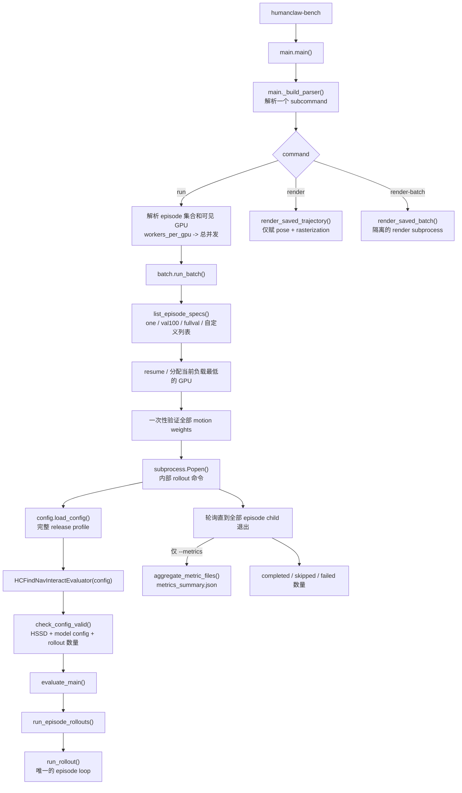
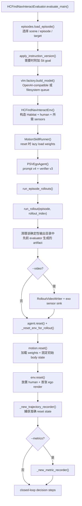
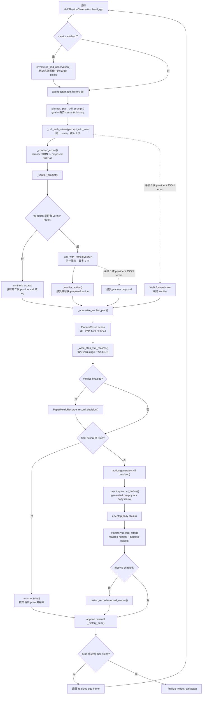
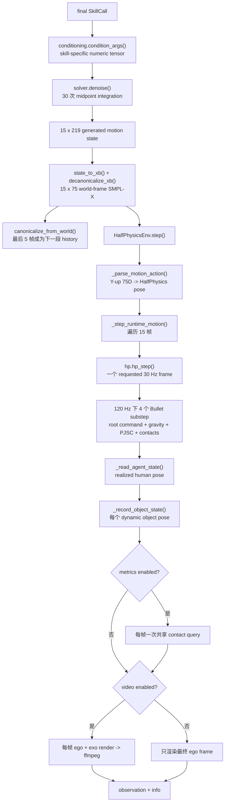
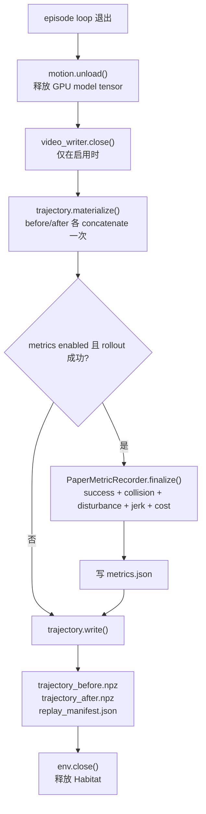

<div align="right"><a href="ARCHITECTURE.md">English</a></div>

# 评测架构

HumanClawBench 只有一套 single-episode evaluation implementation。公开的
`run` 命令选择一个 episode、val100、fullval 或自定义列表，然后 dispatcher
把它们调度为相互独立的内部 `rollout` subprocess；不存在第二套 agent loop
或 metric implementation。

最短的推荐阅读顺序：

1. [`main.py`](../src/humanclaw_bench/main.py)：命令入口和分发。
2. [`evaluation/evaluator.py`](../src/humanclaw_bench/evaluation/evaluator.py)：
   对象构造、episode loop 和 artifact 生命周期。
3. [`agent/planner.py`](../src/humanclaw_bench/agent/planner.py)：planner、可选
   verifier 和最终 action 选择。
4. [`motion/runner.py`](../src/humanclaw_bench/motion/runner.py)：带条件的 motion
   generation 和 autoregressive motion state。
5. [`envs/find_nav_interact_env.py`](../src/humanclaw_bench/envs/find_nav_interact_env.py)
   与 [`envs/half_physics_env.py`](../src/humanclaw_bench/envs/half_physics_env.py)：
   task semantics、Habitat 和物理执行。
6. [`evaluation/trajectory.py`](../src/humanclaw_bench/evaluation/trajectory.py)、
   [`evaluation/video.py`](../src/humanclaw_bench/evaluation/video.py) 和
   [`evaluation/metrics/episode.py`](../src/humanclaw_bench/evaluation/metrics/episode.py)：
   三条输出分支。

## 1. 命令入口流程



`pyproject.toml` 中的 console script 直接指向 `main.main()`。`run_batch()`
从 canonical `.json.gz` shard 读取 episode identity，并为每个 episode 启动
同一个内部 rollout 命令。`--gpus auto` 遵守 `CUDA_VISIBLE_DEVICES`；显式 GPU
ID 和 `--workers-per-gpu` 只影响调度，不改变评测语义。

## 2. Evaluator 的构造



`HCFindNavInteractEpisode` 是标准化的 task record：包含 instruction、scene、
target category/instance、start pose 和最大 step 数，不包含 simulator 或 rollout
结果。`HCFindNavInteractEnv` 持有 live scene；`MotionSkillRunner` 持有 motion
model state；`PSVEgoAgent` 持有 planner state；evaluator 管理它们的生命周期
并完成连接。

这些模块之间传递的主要 value 有意保持紧凑并带类型：

| Value | 产生者 | 使用者 | 含义 |
|---|---|---|---|
| `HCFindNavInteractEpisode` | `load_episode()` | agent、environment、recorder | 不可变的 task、target、scene、spawn 和 step limit。 |
| `HalfPhysicsObservation` | `env.reset()` / `env.step()` | evaluator | 当前 realized ego RGB；不会向 VLM 暴露隐藏 simulator state。 |
| `PlannerResult` | `agent.act()` | evaluator | Parsed planner/verifier record，以及唯一权威的 final `SkillCall`。 |
| `GeneratedMotion` | `motion.generate()` | trajectory recorder、environment | World-frame 75-D SMPL-X 表示的 15 个 requested pre-physics frame。 |
| `info["body_state"]` | `env.step()` | trajectory recorder | HalfPhysics 实际实现的对应 15 个 humanoid pose。 |
| `info["object_states"]` | `env.step()` | trajectory recorder | 每个 dynamic object 的 frame-aligned pose。 |
| `info["metric_frames"]` | metric 模式下的 `env.step()` | metric recorder | 仅内存共享的 contact rows；绝不写 raw trace。 |
| `history` | evaluator `_history_item()` | 下一次 planner call | 只保留有界 semantic/action context；不复制图像和 raw provider payload。 |

Environment reward 始终返回 `0.0`；评测由 VLM closed loop 和最终论文指标
驱动，不使用 RL reward signal。

## 3. 一个 closed-loop decision step



Planner call 每一步都会发生。Verifier v3 只在 Walk、Stop、Climb upstairs、
第一次 turn-for-sit 或 stop-after-sit 对应 route 上调用。其他 skill 直接通过
内存中的 synthetic accept 使用 planner proposal。无论哪种情况，唯一被执行的
都是 `PlannerResult.action`；若 verifier 替换了 action，原 proposal 绝不会执行。

Retry 不会重置 Habitat 或 motion state。Planner 连续 5 次仍没有有效 JSON 时，
执行一次 `Walk<forward><slow>`，再根据得到的新 observation 规划。由于同一
provider path 刚连续失败 5 次，这个 fallback 不再调用 verifier。Verifier 连续
5 次失败时，则接受已有的有效 planner proposal 并继续。

## 4. 从一个 SkillCall 到下一张 ego image



两份 trajectory 有意记录边界两侧：`trajectory_before.npz` 是 generator 请求的
motion；`trajectory_after.npz` 是 Habitat 在 gravity/contact 后实际得到的 pose。
后者同时包含 dynamic-object pose，所以 delayed video 和 disturbance analysis
不需要再次 physics rollout。

## 5. Finalization 与输出分支

`run_rollout()` 在 `finally` 中 finalization，所以 provider call 失败时仍可留下
有用的 partial replay。顺序如下：



Baseline 路径始终写 per-call VLM record 和 replay bundle。`--video` 只增加
frame sink 与两份 MP4；`--metrics` 只增加 semantic/contact collection 和一份
最终 `metrics.json`。两个 flag 相互独立，可以同时使用。

## 6. 逐函数职责

### 入口、episode 选择与调度

| 文件与函数 | 职责 |
|---|---|
| `main._build_parser()` | 定义公开 subcommand 与 flag，不执行评测。 |
| `main.main()` | 分发命令，将参数转换为 evaluator 或 batch config。 |
| `config.load_config()` | 加载并验证完整、不继承的 experiment profile。 |
| `batch._load_episode_subset()` | 对照 full validation 验证 `val100.json` 等透明子集。 |
| `batch._rollout_complete()` | 只检查当前 flag 要求的最终 artifact，实现 `--resume`。 |
| `batch._least_loaded_device()` | 在指定 GPU 间平衡 live subprocess。 |
| `batch.run_batch()` | 选择 episode、一次验证 weights、启动 rollout subprocess，并按需聚合 metrics。 |
| `episodes.list_episode_specs()` | 直接从 scene shard 列出 canonical episode identity。 |
| `episodes.load_episode()` | 选择并验证一个 shard entry，返回 `HCFindNavInteractEpisode`。 |
| `episodes.apply_instruction_version()` | 为支持 interaction 的 category 添加最终 Sit instruction。 |
| `HCFindNavInteractEvaluator.check_config_valid()` | 在重计算前检查 HSSD、model config、rollout 数量和 profile/model compatibility。 |
| `HCFindNavInteractEvaluator.evaluate_main()` | 构造 episode、VLM adapter、environment、motion runner 和 agent。 |
| `_clear_generated_rollout_artifacts()` | 主动复用 rollout 目录时，只删除已知 evaluator output。 |
| `rollout_dir()` | 构造确定性的 episode/rollout 输出路径。 |
| `run_episode_rollouts()` | 对选定 episode 运行相互独立的 rollout index。 |
| `run_rollout()` | 持有唯一 closed-loop evaluation loop 和全部 runtime cleanup。 |
| `_reset_env_for_rollout()` | 先 reset motion、转换 seed pose，再把 physical environment reset 到同一 pose。 |
| `_new_trajectory_recorder()` | 捕获准确 reset-time human/object state 和 replay metadata。 |
| `_new_metric_recorder()` | 仅在请求时 lazy import 并构造 metric stack。 |
| `_history_item()` | 只保留下次 prompt 所需的 semantic planner/action field。 |
| `_write_step_vlm_records()` | 每个逻辑 planner/verifier stage 写一份小型 prompt/final-response JSON。 |
| `_finalize_rollout_artifacts()` | 关闭 video、共享一次 trajectory materialization、写 replay 并关闭 Habitat。 |

### Agent 与模型调用

| 文件与函数 | 职责 |
|---|---|
| `vlm.factory.build_model()` | 选择 direct OpenAI-compatible 或 filesystem-queue adapter。 |
| `OpenAICompatibleModel.respond()` | 发出一次 multimodal chat request，并暴露 provider token usage。 |
| `FilesystemQueueModel.respond()` | 与持有 credential 的外部 worker 交换一次 request/response。 |
| `prompts.resolve_prompt_version()` / `render()` | 选择并组合一个 self-contained planner prompt version。 |
| `verifiers.resolve_verifier_version()` | 加载 self-contained verifier，并检查其 interface。 |
| `HumanClawBenchPSVPlanSkillPlanner._call_with_retries()` | 在不重置 episode 的情况下，原地重试当前 planner/verifier stage，最多 5 次。 |
| `verifiers.v3.route_prompt()` / `render()` | 只选择并组合 proposed action 所需的 verifier route。 |
| `PSVEgoAgent.reset()` / `act()` | 面向 benchmark 的轻量 planner wrapper。 |
| `planner.reset()` | Episode 开始时清空 current plan 和 turn-for-sit state。 |
| `_plan_skill_history()` | 构造有界 semantic history，不重复 image、raw provider text 或 token record。 |
| `_plan_skill_prompt()` | 根据 goal、当前 step 和 history 渲染指定版本 prompt。 |
| `_call()` | 附加 ego image、调用一次 VLM、snapshot usage，并把 transport/JSON error 保存在 stage result 中。 |
| `_chooser_action()` / `_clamp_*()` | 把 action ID/name 转换为落在支持数值范围内的 `SkillCall`。 |
| `_planner_from_plan_skill()` / `_skiller_from_plan_skill()` | 将单一 planner response 拆成 planning field 和 executable action field。 |
| `_apply_plan_skill_output()` | 更新有界 mid-level plan/horizon state。 |
| `_gate_turn_for_sit_verifier()` | 一个 sequence 中只为第一次 preparatory turn 调用 turn-for-sit verifier。 |
| `_verifier_prompt()` | 选择并渲染 verifier-v3 route；不适用时返回空。 |
| `_verifier_action()` | 将 accept/replace verdict 转换为最终 executable action。 |
| `_normalize_verifier_plan()` | 在稳定 verifier record 中同时保存 proposed/final action。 |
| `_combined_raw_plan()` | 生成供 environment/history 使用的小型 planner/verifier reasoning view。 |
| `_update_turn_for_sit_state()` | 只携带下一次 sitting transition 所需的 approval state。 |
| `planner.act()` | 调度以上函数，返回含唯一权威 final action 的 `PlannerResult`。 |

### Motion generation

| 文件与函数 | 职责 |
|---|---|
| `checkpoints.load_skill_models()` | 验证固定文件、重建准确 base variant、挂接每个 ControlNet，并移动到 device。 |
| `motion.networks.*.forward()` | 实现固定 MotionDiT/skill-control forward；不含训练或 checkpoint 选择逻辑。 |
| `MotionSkillRunner.load_skills()` / `unload()` | Lazy load 请求的 skill set，并在结束后释放 tensor。 |
| `MotionSkillRunner.reset()` | 加载五帧 seed，初始化 episode/world reference transform。 |
| `conditioning.condition_args()` | 把公开 skill condition 转换为各 network 的训练输入 convention。 |
| `solver.denoise()` | 用 midpoint flow solver 从 Gaussian noise 生成 15 个 future frame。 |
| `state_to_xb()` / `state_to_joints()` | 从 219-D model state 提取 SMPL-X body parameter/joint。 |
| `decanonicalize_xb()` / `decanonicalize_joints()` | 将 canonical model output 放入累积的 episode world frame。 |
| `canonicalize_from_world()` | 把最后五个 generated world frame 转为下一 skill call 的 model history。 |
| `MotionSkillRunner.generate()` | 连接 condition、denoising、world placement 和 history update，返回 `GeneratedMotion`。 |

### Environment 与 HalfPhysics

| 文件与函数 | 职责 |
|---|---|
| `HCFindNavInteractEnv.reset()` | 只在 metric 模式解析 target instance，reset HalfPhysics、应用 lighting，并返回首张 ego view。 |
| `_resolve_target_refs()` / `_assign_target_semantic_ids()` | 将 dataset goal 匹配到 live Habitat instance，并为 metric-only semantic render 标注。 |
| `metric_find_observation()` | 在当前 VLM 图像中统计 target semantic pixel。 |
| `metric_target_geometry()` | 计算 Nav metric 的最终 body-to-target AABB distance。 |
| `is_pelvis_target_contact()` | 将 pelvis contact 匹配到准确 target mesh instance。 |
| `HCFindNavInteractEnv.step()` | 将显式 Stop 路由到 `_stop_step()`；其他 motion chunk 进入 `HalfPhysicsEnv.step()`。 |
| `HalfPhysicsEnv._build_runtime()` | 加载指定 backend/asset，并只构造一次 Habitat 与 humanoid。 |
| `_build_simulator()` | 只创建当前 flag 所需 sensor，并加载 physical scene。 |
| `_load_agent()` | 按需加载 URDF、SMPL-X mapping、collision body、friction、link ID 和 metric name。 |
| `HalfPhysicsEnv.reset()` / `_reset_runtime_pose()` | 放置准确 seed pose，并渲染已启用的初始 observation。 |
| `_parse_motion_action()` | 验证 generated chunk，将 75-D Y-up motion 转为 simulator pose layout。 |
| `_step_runtime_motion()` | 推进每个 generated frame，记录 realized human/object state，并只采集启用的 observation。 |
| `hp.hp_step()` | 将一个 requested 30 Hz pose delta 转为四个带 gravity、capped drive、PJSC 和 contact 的 120 Hz Bullet substep。 |
| `hp.approximate_*`、`hp.quat_*`、`_shortest_arc_joint_velocity()` | 计算 root/joint drive，避免 quaternion long-arc velocity error。 |
| `hp._apply_*gravity()` | 按配置的 substep timing 应用 human-root gravity 和持续 movable-object gravity。 |
| `hp._ensure/_update/_zero_pjsc_joint_motors()` | 在一帧内创建、推进并关闭 per-joint position-correction motor。 |
| `_read_agent_state()` / `_record_object_state()` | 将 live Habitat state 转回 frame-aligned replay 坐标。 |
| `_update_cameras()` | 将 ego 和可选 exo camera 绑定到 realized humanoid pose。 |

### Replay、video 与 metrics

| 文件与函数 | 职责 |
|---|---|
| `build_replay_metadata()` | 固定 episode、physics、camera、asset path/hash 和 coordinate-frame contract。 |
| `TrajectoryRecorder.record_before()` | 追加 generated 75-D pre-physics chunk 及其 action boundary。 |
| `TrajectoryRecorder.record_after()` | 为同一批 frame 追加 realized human 和全部 dynamic-object pose。 |
| `TrajectoryRecorder.materialize()` | 只 concatenate 一次 record，并在 metric/serialization 间共享。 |
| `TrajectoryRecorder.write()` | 写两份 compressed NPZ 和带 hash 的 replay manifest。 |
| `RolloutVideoWriter.append()` / `close()` | 将同步 ego/exo RGB 直接送入两个 H.264 pipe，并安全关闭。 |
| `PaperMetricRecorder.record_decision()` | 根据当前 image/decision pair 更新 Find、active-stop 和 token usage。 |
| `PaperMetricRecorder.record_motion()` | 让 collision、disturbance 和 final-frame Sit contact 复用同一 30 Hz contact stream。 |
| `PaperMetricRecorder.finalize()` | 计算 terminal Nav/Interact、disturbance、Motion Jerk、cost 和已累计的 collision。 |
| `claims_target_visible()` | 对 planner visible-state text 应用 target-name/negation 规则。 |
| `body_to_target_aabb_distance()` | 计算 NavSR 的最终 3D body-point 到 target-AABB 最小距离。 |
| `UsageTracker.record()` / `summary()` | 标准化 provider usage，或明确标记 fallback token estimate。 |
| `CollisionTracker.record_reset()` / `record_step()` | 一次记录 reset penetration，随后从其他 metric 共用的 post-physics 30 Hz rows 分类 fixed contact。 |
| `DisturbanceTracker.record_step()` / `finalize()` | 在线跟踪有时间顺序的 affected object，并计算 realized path length。 |
| `root_rigid_motion_jerk()` | 在论文有效时间尺度上评价 generated pre-physics root-rigid motion。 |
| `aggregate_metric_files()` | 将完成的 per-episode metric 文件聚合为完整表格字段。 |
| `render_saved_trajectory()` | 单独恢复 saved post-physics pose 并 rasterize video，不调用 VLM、motion generation 或 physics step。 |
| `render_saved_batch()` | 在隔离的 Habitat/OpenGL subprocess 中执行 delayed render job。 |

私有 JSON、array-shape、quaternion 和 path helper 支持上述函数，但不引入额外
evaluation stage。

## Half-Physics frame contract

`envs/half_physics/hp.py` 是唯一 production backend。一个 generated 30 Hz
frame 被解析为四个 120 Hz Bullet substep。Generated root x/z velocity 在从零
计数的 substep 0 和 2 赋值；contact 可在 substep 1 和 3 改变它。Root angular
velocity 只在 substep 0 前赋值一次。Vertical root velocity 始终由
gravity/contact 驱动。

每个 joint drive 和 root angular drive 都限制为每个 generated frame 30 度。
Quaternion sign change 在限制前转换为 shortest arc。PJSC expected-position
trajectory 使用未限制的 velocity，所以该安全限制不会减慢其 target。两个
shoulder 的固定 PJSC gain 为 0.03，两个 wrist 为 0.1。Habitat 对 Python 可见的
所有 human child link 应用 friction 0.4；pelvis base 不由 Habitat per-link API
暴露。`humanclaw.physics_config.json` 中的 `friction_coefficient: 1.0` 有意表示
scene/default 值，不是 human-link override。

每个真实 Bullet substep 前，movable object 都收到 `mass * gravity`。Backend、
command schedule、PJSC gain、human friction 和重命名后的 physics config 都写入
`replay_manifest.json`，便于 delayed diagnosis 查看准确 runtime contract。

`--video` 构造 exo sensor 并渲染每个 physics frame。Frame 直接进入两个
ffmpeg pipe，因此内存有界，且不产生 frame 文件。

独立的 `render` 命令是快速 delayed-video 路径。它读取
`trajectory_after.npz`，恢复已记录的人体和全部 dynamic object，更新两台
camera，并在不推进 physics 的情况下 rasterize。`render-batch` 为每个任务启动
一个 renderer subprocess，使 OpenGL context 保持隔离，同时在指定 GPU 上并行。
该路径不写 PNG，也不执行 VLM、motion generation、contact、semantic 或 metric
工作。

`--metrics` 构造 semantic sensor，并在每个 realized 30 Hz pose 上启用一次共享
contact query。Find 使用与当前 VLM image 对齐的 semantic map。Collision、
Interact 和 disturbance 使用相同的 in-memory contact rows，并立即丢弃。Episode
结束时，trajectory array 只为 Motion Jerk 和 NPZ serialization materialize 一次；
collision 不做 terminal replay 或第二轮 contact pass。

## 输出边界

Evaluator 为每个逻辑 VLM stage 写一份包含最终 attempt 的 JSON；之前的 retry
attempt 只在内存中用于 token accounting：

```text
stepNNN_percept_mid_low.json
stepNNN_verifier.json        # 仅 verifier 确实被调用时
```

并且只写一套 replay bundle：

```text
trajectory_before.npz        # generated motion + 准确 initial state
trajectory_after.npz         # physics-resolved human + 全部 dynamic objects
replay_manifest.json         # replay 参数、asset hash、NPZ hash
```

不会生成 combined episode log、duplicate trajectory、raw contact trace、semantic
map、per-step metric、frame directory 或 status log。Step 之间保留的 in-memory
history 只包含构造下一次 prompt 所需字段。

可选输出保持紧凑：

```text
metrics.json                 # 仅 --metrics
ego.mp4, exo.mp4             # 仅 --video
metrics_summary.json         # 多 episode --metrics
```

## 配置边界

`configs/paper_fullval_v1.json` 完整且不继承，固定 episode、prompt version、
motion skill、weight manifest、initial seed、HalfPhysics implementation、rendering
和所有 metric threshold。Model endpoint、credential 和 model-specific output
limit 放在单独的 model config 中。
